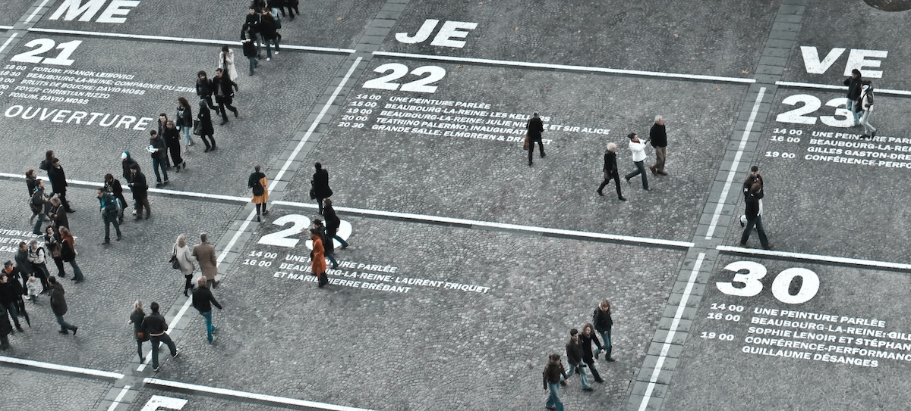
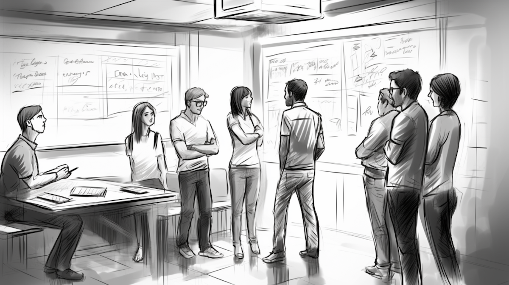
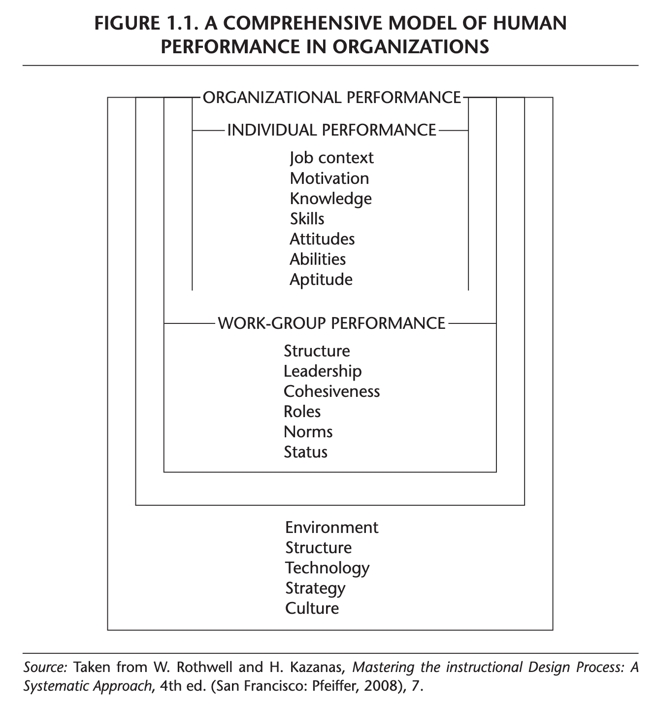

```{r setup, include=FALSE}
usethis::use_git_ignore(c("*.csv", "*.rds"))
options(htmltools.dir.version = FALSE)

library(knitr)
library(tidyverse)
library(xaringan)
library(fontawesome)
```

class: inverse, center, middle

# `r fa("fas fa-images", fill = "#fff")`

**View the slides:** 

[bretsw.com/eme5601-fs24-module1](https://bretsw.com/eme5601-fs24-module1)

---

class: inverse, center, middle

# `r fa("fas fa-door-open", fill = "#fff")` <br><br> Welcome to EME5601!

---

class: inverse, center, middle

# `r fa("fas fa-door-open", fill = "#fff")` <br><br> Introduce yourself <br> (again)

**Name**

**Preferred pronouns**

**Course goals** (answering "Why are you here?")

**Favorite system** (e.g., gaming console, cooking recipe, writing habits)


---

class: inverse, center, middle

# `r fa("fas fa-map", fill = "#fff")` <br><br> Course Tour

---

# `r fa("fas fa-calendar-day", fill = "#fff")` Semester Schedule

```{r, out.width = "360px", echo = FALSE, fig.align = "center"}

```

--

- **Module 1: Introduction to Instructional Systems Design**

--

- **Module 2:** Systems Analysis

--

- **Module 3:** Performance Analysis

--

- **Module 4:** Needs Assessment

--

- **Module 5:** Work Analysis

--

- **Module 6:** Design & Development

--

- **Module 7:** Evaluation

---

# `r fa("fas fa-list", fill = "#fff")` Module Structure

```{r, out.width = "540px", echo = FALSE, fig.align = "center"}
include_graphics("img/workshop.jpg")
```

--

- `r fa("fas fa-video", fill = "#782F40")` Optional Office Hours: **Wednesdays 2:30-3:00pm ET**

--

- `r fa("fas fa-book-open", fill = "#782F40")` Read

--

- `r fa("far fa-comments", fill = "#782F40")` Meet: **Wednesdays 3:05-5:40pm ET**

--

- `r fa("fas fa-keyboard", fill = "#782F40")` Create

---

# `r fa("far fa-keyboard", fill = "#fff")` Major Assignments

```{r, out.width = "260px", echo = FALSE, fig.align = "center"}
include_graphics("img/build.jpg")
```

- **Assignments** (70%)

--

  - Module 2 Assignment: Systems Analysis paper (150 points)

--

  - Module 3 Assignment: Annotated Bibliography 1 (50 points)

--

  - Module 4 Assignment: Needs Assessment paper (150 points)

--

  - Module 5 Assignment: Annotated Bibliography 2 (50 points)

--

  - Module 6 Assignment: Work Analysis paper (150 points)

--

  - Module 7 Assignment: ISD Process Model paper (150 points)
  
---

class: inverse, center, middle

# `r fa("fas fa-cubes-stacked", fill = "#fff")` <br><br> What is a system?

--

(Why instructional <u>**systems**</u> design?)

---

class: inverse, center, middle

# `r fa("fas fa-cubes-stacked", fill = "#fff")` <br><br> Searching for Systems


---

# Agile Standup Meetings

<div style="width: 100%;">
<div style="position: relative; width: 100%; overflow: hidden; padding-top: 56.25%;">
<p><iframe style="position: absolute; top: 0; left: 0; right: 0; width: 100%; height: 100%; border: none;" src="https://www.youtube.com/embed/mANyczXTqOY?si=ZN4jCJTORLgYE1r2" width="560" height="315" allowfullscreen="allowfullscreen" allow="accelerometer; autoplay; clipboard-write; encrypted-media; gyroscope; picture-in-picture"></iframe></p>
</div>
</div>

---

class: inverse, center, middle

# Standup

```{r, out.width = "100%", echo = FALSE, fig.align = "center"}

```


---

class: inverse, center, middle

# `r fa("fas fa-cubes-stacked", fill = "#fff")` <br><br> Module 1 <br> Intro to ISD

---

class: inverse, center, middle

# `r fa("fas fa-cubes-stacked", fill = "#fff")` <br><br> Instructional Systems Design (ISD) = <br><br> analyzing human performance problems systematically

(Rothwell et al., 2016, p. 3)

---

# `r fa("fas fa-cubes-stacked", fill = "#fff")` 6 Characteristics of ISD

```{r, out.width = "600px", echo = FALSE, fig.align = "center"}

```

1. Emerging profession
2. Focused on establishing and maintaining efficient and effective human performance
3. Guided by a model of human performance
4. Carried out systematically
5. Based on Open Systems Theory
6. Oriented to finding and applying the most cost-effective solutions to human performance problems

---

# `r fa("fas fa-cubes-stacked", fill = "#fff")` 6 Characteristics of ISD

```{r, out.width = "600px", echo = FALSE, fig.align = "center"}

```

1. **Emerging profession**
2. Focused on establishing and maintaining efficient and effective human performance
3. Guided by a model of human performance
4. Carried out systematically
5. Based on Open Systems Theory
6. Oriented to finding and applying the most cost-effective solutions to human performance problems

---

# `r fa("fas fa-cubes-stacked", fill = "#fff")` 6 Characteristics of ISD

```{r, out.width = "600px", echo = FALSE, fig.align = "center"}

```

1. Emerging profession
2. **Focused on establishing and maintaining efficient and effective human performance**
3. Guided by a model of human performance
4. Carried out systematically
5. Based on Open Systems Theory
6. Oriented to finding and applying the most cost-effective solutions to human performance problems

---

# `r fa("fas fa-cubes-stacked", fill = "#fff")` 6 Characteristics of ISD

```{r, out.width = "280px", echo = FALSE, fig.align = "center"}

```

<div class="caption">
Figure 1.1 from Rothwell et al. (2016, p. 8)
</div>

1. Emerging profession
2. Focused on establishing and maintaining efficient and effective human performance
3. **Guided by a model of human performance**
4. Carried out systematically
5. Based on Open Systems Theory
6. Oriented to finding and applying the most cost-effective solutions to human performance problems

---

# `r fa("fas fa-cubes-stacked", fill = "#fff")` 6 Characteristics of ISD

```{r, out.width = "480px", echo = FALSE, fig.align = "center"}

```

<div class="caption">
Figure 1.1 from Rothwell et al. (2016, p. 8)
</div>

---

# `r fa("fas fa-cubes-stacked", fill = "#fff")` 6 Characteristics of ISD

```{r, out.width = "600px", echo = FALSE, fig.align = "center"}

```

1. Emerging profession
2. Focused on establishing and maintaining efficient and effective human performance
3. Guided by a model of human performance
4. **Carried out systematically**
5. Based on Open Systems Theory
6. Oriented to finding and applying the most cost-effective solutions to human performance problems

---

# `r fa("fas fa-cubes-stacked", fill = "#fff")` 6 Characteristics of ISD

```{r, out.width = "560px", echo = FALSE, fig.align = "center"}
include_graphics("img/Rothwell-fig1-3.png")
```

<div class="caption">
Figure 1.3 from Rothwell et al. (2016, p. 12)
</div>

1. Emerging profession
2. Focused on establishing and maintaining efficient and effective human performance
3. Guided by a model of human performance
4. Carried out systematically
5. **Based on Open Systems Theory**
6. Oriented to finding and applying the most cost-effective solutions to human performance problems

---

# `r fa("fas fa-cubes-stacked", fill = "#fff")` 6 Characteristics of ISD

```{r, out.width = "600px", echo = FALSE, fig.align = "center"}

```

1. Emerging profession
2. Focused on establishing and maintaining efficient and effective human performance
3. Guided by a model of human performance
4. Carried out systematically
5. Based on Open Systems Theory
6. **Oriented to finding and applying the most cost-effective solutions to human performance problems**

---

class: inverse, center, middle

# `r fa("fas fa-cubes-stacked", fill = "#fff")` <br><br> ISD = <br><br> analyzing human performance problems systematically

**What are the human performance problems in your field?**

---

class: inverse, center, middle

# `r fa("fas fa-triangle-exclamation", fill = "#fff")` <br><br> Critiques of ISD

---

# `r fa("fas fa-triangle-exclamation", fill = "#fff")` Critiques of ISD

```{r, out.width = "360px", echo = FALSE, fig.align = "center"}

```

--

- Too slow

--

- Too linear

--

- Too out of touch with technology

---

# `r fa("fas fa-share-nodes", fill = "#fff")` Alternatives to ISD

- Successive Approximation Model (SAM): rapid prototyping

--

- Idiosyncratic approaches: survival 

--

- Universal Design for Learning (UDL)

--

- Culturally Sustaining Instructional Design

```{r, out.width = "320px", echo = FALSE, fig.align = "center"}
include_graphics("img/CSID-model.png")
```

<div class="caption">
Smith & Staudt Willet (2023) in <a href="https://edtechbooks.org/jaid_12_2/a_model_for_culturally_sustaining_instructional_design">Journal of Applied Instructional Design</a>
</div>


---

class: inverse, center, middle

# `r fa("far fa-comments", fill = "#fff")` <br><br> How would you redesign ISD?

---

# Scrum Groups

<div style="width: 100%;">
<div style="position: relative; width: 100%; overflow: hidden; padding-top: 56.25%;">
<p><iframe style="position: absolute; top: 0; left: 0; right: 0; width: 100%; height: 100%; border: none;" src="https://www.youtube.com/embed/UKd4N86p43k?si=yysZ218aBwTl8Iob" width="560" height="315" allowfullscreen="allowfullscreen" allow="accelerometer; autoplay; clipboard-write; encrypted-media; gyroscope; picture-in-picture"></iframe></p>
</div>
</div>

---

class: inverse, center, middle

# Sorting

```{r, out.width = "100%", echo = FALSE, fig.align = "center"}
include_graphics("img/plinko.png")
```

---

class: inverse, center, middle

# Scrum

```{r, out.width = "100%", echo = FALSE, fig.align = "center"}
include_graphics("img/scrum.png")
```

### How would you redesign ISD?

---

class: inverse, center, middle

# Standup

```{r, out.width = "100%", echo = FALSE, fig.align = "center"}

```

### Instructional Systems Design, Re-imagined


---

class: inverse, center, middle

# Standup

```{r, out.width = "100%", echo = FALSE, fig.align = "center"}

```

### What other topics do we need to cover?


---

class: inverse, center, middle

# Solo

```{r, out.width = "100%", echo = FALSE, fig.align = "center"}
include_graphics("img/thinking.png")
```

### What do you want to remember about systems from today?


---

class: inverse, center, middle

# `r fa("fas fa-binoculars", fill = "#fff")` <br><br> Looking ahead

---

class: inverse, center, middle

# `r fa("fas fa-question", fill = "#fff")` <br><br> Questions

<hr>

**What questions can I answer for you now?**

**How can I support you this week?**

<hr>

`r fa("fas fa-envelope", fill = "#fff")` [bret.staudtwillet@fsu.edu](mailto:bret.staudtwillet@fsu.edu) | `r fa("fas fa-globe", fill = "#fff")` [bretsw.com](https://bretsw.com) | `r fa("fab fa-github", fill = "#fff")` [GitHub](https://github.com/bretsw/)